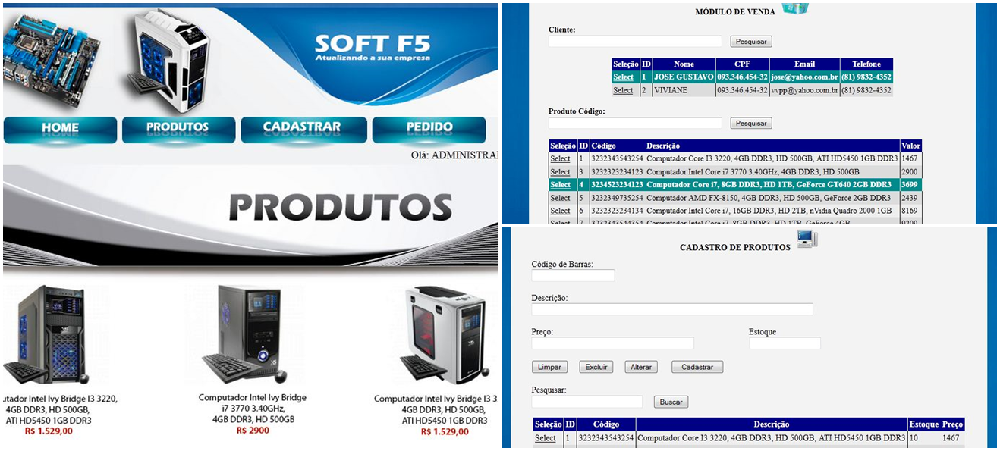

## Escola Técnica - Projeto Integrador III - C#

###  :computer: Tela

  

----------

### :hammer_and_wrench: Ferramentas
As seguintes tecnologias foram utilizadas na construção do projeto:
- C#;
- ASP.NET;
- Visual Studio 2010;
- Banco de Dados MySQL.

----------

###  :gear: Funções
- [x] PDV (Ponto de Venda);
- [x] CRUD de Clientes;
- [x] CRUD de Produtos;
- [x] Painel Administrador.

----------

###  :eyeglasses: Autor
José Gustavo da Silva.
[
**Linkedin**
](https://www.linkedin.com/in/jose-gustavo312/)